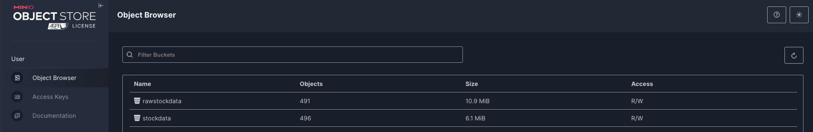

# Project Installation & Deployment

This guide outlines the steps required to run the application, which consists of:
- **MinIO** instance for storing raw data (S3-compatible object storage).
- **MongoDB** instance for database storage.
- **FastAPI** application that interacts with ETL artifacts (MongoDB) and processed Stock Data (MinIO).
- **Spark** transformation engine for APIs with a log server.
- **Spark-Operator** dynamic transformation engine for ETL processes.
- **Airflow** actively watch `rawstockdata` bucket and trigger ETL process for new folders detected.

---

## Prerequisites

1. **Minikube**  
   Install Minikube following the official guide:  
   [https://minikube.sigs.k8s.io/docs/start/?arch=%2Fmacos%2Farm64%2Fstable%2Fhomebrew](https://minikube.sigs.k8s.io/docs/start/?arch=%2Fmacos%2Farm64%2Fstable%2Fhomebrew)

2. **Docker**  
   Download and install Docker Desktop:  
   [https://www.docker.com/products/docker-desktop/](https://www.docker.com/products/docker-desktop/)

3. **mc (MinIO Client)** for uploading data  

   Install via Homebrew (on macOS):

   ```
   brew install minio/stable/mc
   ```

4. **Helm** for spark-operator 

   Install via Homebrew (on macOS):

   ```
   brew install helm
   ```

---
## Docker images
Features in StockETL-Pyspark-Mongo-Kubernetes are build in 3 different ways:
1) With my-docker images:
   - API scripts (python:3.12-bookworm)
   - ETL script (bitnami/spark:3.5.5)
   - Airflow (apache/airflow:2.10.5-python3.12)
2) With external-docker images:
   - spark-master (bitnami)
   - spark-worker (bitnami)
   - spark-logs (bitnami)
   - minio (minio/minio)
   - mongo (mongo:6.0)
3) With Helm:
   - Spark-operator

---
## Set Up MinIO Credentials

1. **Generate base64-encoded username and password**:

   ```
   echo -n '<USER_NAME>' | base64
   echo -n '<PASSWORD>' | base64
   ```

   Example:

   ```
   echo -n 'minio' | base64
   echo -n 'minio321' | base64
   ```

2. **Open the secret configuration file**:

   ```
   minikube/minio/minio-secret.yaml
   ```

3. **Paste the encoded credentials**:

   ```
   minio-access-key: <ENCODED_USERNAME>
   minio-secret-key: <ENCODED_PASSWORD>
   ```

> These credentials will allow you to **log in to the MinIO UI**. The application will automatically use them to read and write data to S3.

---

## Deploy FastAPI, MinIO, MongoDB & Spark to Kubernetes

1. **Make the deployment script executable**:

   ```
   chmode -x deploy_all.sh
   ```

2. **Run the full deployment (Docker & Kubernetes)**:

   ```
   ./deploy_all.sh
   ```

3. **Verify pods**:

   ```
   kubectl get pods -A
   ```
You should see sth like this:


---

## Upload Raw Stock Data to MinIO

1. **Make the data upload script executable**:

   ```
   chmode -x load_raw_data_minio.sh
   ```

2. **Run the data upload with argument**:

   a) Upload single folder with:

   ```
   ./load_raw_data_minio.sh <FOLDER_NAME>
   ```
   b) Upload all files with:
   ```
   ./load_raw_data_minio.sh ALL
   ```

3. **Access the MinIO UI**:

   ```
   make minio-ui
   ```
   Use credentials you set up in the first step

---

## Turn on ETL airflow

1) Open airflow UI with:
   ```
   make airflow-ui
   ```
2) Use creds: admin, admin -> unless you change updated the `airflow-deployment.yaml`
3) Tab in browser should be automatically open:


4) Unpause DAG by clicking toggle

## DAG step-by-step:

1) DAG is run every 30 second.
2) It watches folders in `rawstockdata` bucket.
3) If it finds new folder the ETL process begun.
4) DAG apply spark-operator-etl-job manifest with argument of new folder name.
5) Only after Spark-job is successful DAG update MongoDB!
6) It adds new folder to `processed_folders` in MongoDB (This folder will not be seen as new folder next time).
7) DAG process will be completed only after all steps are successful.
8) DAG will not start another process in parallel.

**find_new_folder description:**

1. Scans the MinIO bucket (`rawstockdata`) for all available folder names.  
2. Retrieves the list of already processed folders and any `skip_dates` from MongoDB.  
3. If no folder has been processed yet, selects the folder with the **oldest** date.  
4. Otherwise, only considers folders dated **one business day before or after** the most recently processed date (skipping weekends and any `skip_dates`).  
5. If no folder meets these criteria, the task is **skipped**.

All downstream tasks (Spark manifest templating, submission, MongoDB update) execute **only** when a new folder is successfully selected.

> User can add/remove skip_dates via API to skip missing data -> will be explained in API section

## ETL-DAG validation:

1) See the DAG logs in terminal:
   ```
   make airflow-artefacts
   ```
2) Run `ls` and move to the first folder for e.g: `cd run_id=scheduled__2025-04-19T08:03:00+00:00`

3) Now you can see each step of ETL DAG:


4) Open the files inside each folder and see the logs.

5) You can also look at spark-operator job logs by running:
   ```
   make log-etl ID=<RUN_ID>
   ```
   You can find the `RUN_ID` in 'task_id=wait_for_spark_job' folder! But for the first run it should be 0

6) Open Minio and see if `stockdata` bucket has some data:
```
   make minio-ui
   ```

You can immediately see that prepared stock data is better compressed.


---
## Running the APIs

1. Start the Kubernetes application:

   ```
   make run-api
   ```

2. Open the second URL displayed in the terminal output.


   
### Mongo
1. check_mongo_sever
2. get_etl_artifacts_by_run_id
3. get_stock_artifacts_by_ticker_name

> This APIs can help you validate the ETL results

### AirflowMongo
1. get_airflow_artifacts_collection
2. add_skip_date_to_airflow
3. remove_skip_date_from_airflow

> This APIs can help you to communicate with Airflow DAG source db

### Reports
1. get_top_stocks
   
> This API work on spark cluster, and it can present top profit stocks for you extremely fast!


## Checking the Spark Cluster

1. **Forward the Spark UI port in your terminal**:

   ```
   make fwd-spark
   ```

2. **Open the following URL in your web browser**:

   ```
   127.0.0.1:8080
   ```
   
3. **See the Spark History Server**


4. **In the Spark UI, you can monitor**:
   - Available workers and their resources
   - Active applications
   - Completed job runs

Keep in mind that if you didn't run get_top_stocks API you may not see anything there

---

## Viewing Spark Logs

1. **Start the Spark History Server**:

   ```
   minikube service spark-history-service -n stock-etl-namespace
   ```

2. **A browser window should open with the Spark History Server UI.**  
   If not, copy the URL displayed in the terminal and open it manually.

3. **In the Spark History UI, you can**:
   - View a list of completed Spark applications
   - Check each run’s App ID, name, user, duration, and submission time
   - Click on any App ID to:
     - Inspect stages, tasks, and jobs
     - Review execution timelines, performance metrics, and job summaries
     - Visualize DAGs (Directed Acyclic Graphs) for stage dependencies
     - Download event logs for debugging or tuning

---

## Current Features & Future Plans

**Currently available via API**:
- Select top-performing stocks within a given timeframe
- Health-check endpoint for MongoDB connectivity
- Retrieve ETL artifacts from MongoDB
- Communicate with Airflow source DB collection

**Spark operator on k8s**:
- ETL process is now triggerd by Airflow-DAG (applying SparkApplication manifest with appropriate folder name)
- It executes full ETL process using a Spark operator (S3 input/output, MongoDB artifact storage)

**Additional functionality**:
- Debug Spark jobs using the integrated Spark History Server
- Makefile with handy commands for:
  - Pod status checks  
  - Deployment logs  
  - Redeploying apps/images  
  - Managing Kubernetes namespaces  
  - And more...

**Future improvements**:
- Spark history for spark-operator
- Jupyter Notebook integration within the Kubernetes cluster
- Autoscaling for the Spark cluster
- Apache Iceberg layer for the `stockdata` bucket – a metadata‑driven table format that adds ACID snapshots to our stock data S3/MinIO objects, letting us time‑travel and roll back to a consistent version whenever an ETL run fails. 